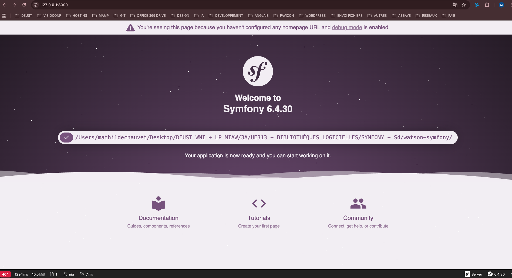

# UEL313-G6-S4

**Projet universitaire Symfony 6.4 (LTS) en groupe** :   Application de gestion de liens stockés en base de données (CRUD : listing, ajout, modification, suppression).

**Dépôt public** :   Le projet est hébergé sur Github [https://github.com/Clouddy23/UEL313-G6-S4/](https://github.com/Clouddy23/UEL313-G6-S4/)

**Licence** :   Projet pédagogique — usage formation.

---

## Objectifs

- Mettre en place une application Symfony **6.4 (LTS)**
- Développer une gestion de liens stockés en base de données :
  - **Lister** les liens
  - **Ajouter** un lien via formulaire (**titre**, **URL**, **descriptif**)
  - **Mettre à jour** un lien
  - **Supprimer** un lien
- Approcher davantage le projet “Watson” en ajoutant :
  - Des **mots-clés** associés aux liens
  - Un **back office** sécurisé
  - Une **gestion d’utilisateurs**
  - Un rendu **Twig/CSS** de base

## Principe général de collaboration

### Membres du groupe

Tous les membres du groupe ont contribué de manière équilibrée et proportionnelle au projet.

| Étudiant.e  |   Alias    |
| :---------: | :--------: |
| Mathilde C. | Clouddy23  |
|   Kamo G.   | Spaghette5 |
| Mathieu L.  |  mathleys  |
| Filippos K. |  filkat34  |

### Répartition du travail

| Activité | Responsable(s) | Branche |
|---|---|---|
| Base projet (Symfony 6.4 LTS) + configuration environnement | Mathilde Chauvet (Clouddy23) | `main` |
| Modèle de données (BDD + entités + migrations) | Filippos K. (filkat34) | `feature/datastructure` |
| CRUD Link (Entity, Form, Controller, Twig) | Mathieu L. (mathleys) | `feature/link controller` `feature/tag controller` |
| UI Twig/CSS (base) | Kamo G. (Spaghette5) | `feature/ui` |
| (Option) Back office + sécurité | Mathieu L. (mathleys) | `feature/backoffice` |
| Documentation + captures + PDF (README → PDF) | Filippos K. (filkat34) & Mathilde C. (Clouddy23) | / |

### Calendrier de suivi du projet

Une réunion visio d'équipe est prévue à chaque fin d'échéance.

| Échéance | Objectif                                                                                          |
| :------: | :------------------------------------------------------------------------------------------------ |
|  15/12   | Phase d’installation : installation Symfony 6.4 LTS, préparation du repository.                   |
|  16/12   | Visio d'organisation : répartition des tâches, création des issues/branches.                      |
|  17/12   | Phase de développement : ???.                                                                     |
|  18/12   | Phase de relecture : Review et correction des branches (PR).                                      |
|  19/12   | Fin du projet : Tests manuels fonctionnels, fusion des branches vers `main`, finalisation du PDF. |

---

## Développement du projet

### Installation de Symfony CLI 6.4 LTS (MacOS + Terminal)

**Outils utilisés** :

PHP + Composer + Symfony CLI + SQLite + DB Browser.   Tous les outils doivent être disponibles “globalement” dans le terminal depuis n’importe quel dossier.

**1) Installation et vérification de la version de Homebrew (gestionnaire de paquets)**

`/bin/bash -c "$(curl -fsSL https://raw.githubusercontent.com/Homebrew/install/HEAD/install.sh)"
brew --version
brew --version`

**2) Installation et vérification de la version PHP**

`brew update
brew install php
php -v`

**3) Vérification des extensions PHP requises (ZIP, SQLite, PDO_SQLITE**

`php -m | grep -E "zip|sqlite|pdo_sqlite"`

Le cas échéant, procéder à l'activation des extensions (suppression ";") :  
`php --ini
extension=zip
extension=pdo_sqlite
extension=sqlite3`

**4) Installation, mise à jour et vérification de la version de Composer (gestionnaire de dépendances PHP)**

`brew install composer
sudo composer self-update
composer -V`

**5) Installation et vérification de Symfony CLI et de ses prérequis**

`brew install symfony-cli/tap/symfony-cli
symfony -V
symfony check:requirements`

**6) Installation DB Browser pour SQLite (outil de visualisation BDD)**

`brew install --cask db-browser-for-sqlite`

### Création du projet Symfony 6.4 LTS (Watson-Symfony)

**1) Se placer dans le dossier de travail (emplacement du projet)**

Création d’un nouveau projet Symfony dans un dossier `watson-symfony` en forçant la version 6.4 LTS :  
`symfony new watson-symfony --version="6.4.*" --webapp
cd watson-symfony`

**2) Configuration de SQLite dans .env.local**

On copie .env vers .env.local afin de : préserver la configuration par défaut (.env) et permettre à chaque membre du groupe d’avoir sa configuration locale (.env.local) :  
`cp .env .env.local
code .env.local`

Dans .env.local, activer DATABASE_URL="SQLite..." (supprimer #) et désactiver DATABASE_URL="postgesql..." (ajouter #).  

**3) Installation de SQLite Browser**

Avec SQLite, la BDD est un fichier .db qui sera créé lors des migrations (après création des entités).  
La visualisation de la BDD peut se faire grâce à l'installation de DB Browser :  
`brew install db-browser-for-sqlite`

**3) Test du lancement du serveur Symfony**

`cd "./S4/watson-symfony"
symfony server:start`

Se rendre à l'URL indiquée par le serveur : http://127.0.0.1:8000

### Mise à jour du fichier .env

- Modification du fichier _.env_ en renseignant l'URL correct de la base de données : `DATABASE_URL="sqlite:///%kernel.project_dir%/var/watson.db"`
- Modification du fichier _.gitignore_ pour exclure le fichier _watson.db_ afin qu'il puisse être partagé avec les collaborateurs.

### Modèle des données et initialisation de la base

Nous avons par la suite procédé à la construction de modèle de données :

- Nous avons d'abord créé les trois classes de l'application watson (User, Tag, Link) ainsi que leurs méthodes en prenant soin de bien traduire le lien d'association entre Link et Tag.
- Dans une perspective de standardisation et de clarté du code, nous avons créé des interfaces pour chacune de ces trois entités.
- Dans le terminal `composer dump-autoload` pour régénerer le fichier autoload de Composer et mettre à jour la liste des classes et fichiers de l'application.
- Dans le terminal `doctrine:schema:update --force` qui permet de créer la base de données _sqlite_ et synchroniser sa structure avec les entités que nous venons de créer.
- En utilisant le logiciel _DBBrowser_ nous avons exécuté des scripts SQL pour remplir la base avec des données pour les tests.

### Installation de Nelmio

Pour faciliter les tests de l'API, nous avons installé Nelmio avec la commande :
`composer require nelmio/api-doc-bundle`

Pour le configurer, nous avons suivi la documentation disponible sur le site de [Symfony](https://symfony.com/bundles/NelmioApiDocBundle/current/index.html#installation)

### Création du contrôleur pour les _Users_

Pour tester que la communication entre la base de données et l'application fonctionne, nous avons créé les différentes méthodes CRUD pour du contrôleur appelé par la route `/users`.

Pour que _Nelmio_ fonctionne, nous avons ajouté au dessus de chacune de ces méthodes l'attribut correspondant commençant par `#[OA\METHOD(...)]`

Nous avons ensuite procédé à des tests de fonctionnement des différentes routes de l'API grâce à l'UI de _Nelmio_ accessible sur `http://localhost:8000/api/doc`

### Création du contrôleur pour les _Liens_

Pour se rapprocher du projet Watson, nous avons ajouté une gestion de mots-clés (tags) associables aux liens.
Un tag peut être relié à plusieurs liens, et un lien pouvant avoir plusieurs tags.

### Création du contrôleur pour les _Tags_

Nous avons également créé les différentes méthodes CRUD pour du contrôleur appelé par la route `/links`.

**Mise en place du modèle de données**  
Nous avons modélisé la relation ManyToMany entre Link et Tag :

- Link possède une collection de Tag ($tags)
- Tag possède une collection de Link ($links)
- Une table link_tag gère les associations en BDD

Pour éviter des incohérences côté application, nous avons synchronisé les deux côtés de la relation dans les méthodes :

- Link::addTag() / Link::removeTag()
- Tag::addLink() / Tag::removeLink()

**Développement du contrôleur API**  
Nous avons développé un contrôleur TagController (API JSON) exposant des routes :

- GET /tags : liste de tous les tags
- POST /tags : création d’un tag (JSON { "name": "..." })
- GET /tags/{id} : détail d’un tag
- PUT /tags/{id} : modification d’un tag
- DELETE /tags/{id} : suppression d’un tag

Nous avons ajouté des routes permettant de gérer la relation tag et lien :

- POST /links/{linkId}/tags/{tagId} : associer un tag existant à un lien
- DELETE /links/{linkId}/tags/{tagId} : dissocier un tag d’un lien
- GET /links/{linkId}/tags : lister les tags d’un lien

Nous avons également réaliser une protection contre la création de doublons :

- Lors de la création d’un tag (`POST /tags`) on vérifie qu’un tag du même nom n’existe pas déjà en base
- Lors de l’association d’un tag à un lien (`POST /links/{linkId}/tags/{tagId}`) une vérification empêche d’ajouter 2 fois le même tag au même lien.

**Tests**  
Pour faciliter les tests, les routes ont été documentées via Nelmio (Swagger UI) et testées à l’aide de requêtes HTTP.

### Tests manuels fonctionnels

### Webographie

- Installation de PHP : [https://www.php.net/downloads.php](https://www.php.net/downloads.php)
- Installation de Composer : [https://getcomposer.org/](https://getcomposer.org/)
- Installation de Symfony CLI : [https://symfony.com/download](https://symfony.com/download)
- Installation de DB Browser pour SQLite : [https://sqlitebrowser.org/](https://sqlitebrowser.org/)
- Calendrier des releases Symfony : [https://symfony.com/releases](https://symfony.com/releases)
- Package - Symfony Demo : [https://packagist.org/packages/symfony/demo](https://packagist.org/packages/symfony/demo)
- Démarrage de Symfony : [https://symfony.com/doc/current/setup.html](https://symfony.com/doc/current/setup.)
- Installation de Nelmio : [https://symfony.com/bundles/NelmioApiDocBundle/current/index.html#installation](https://symfony.com/bundles/NelmioApiDocBundle/current/index.html#installation)

